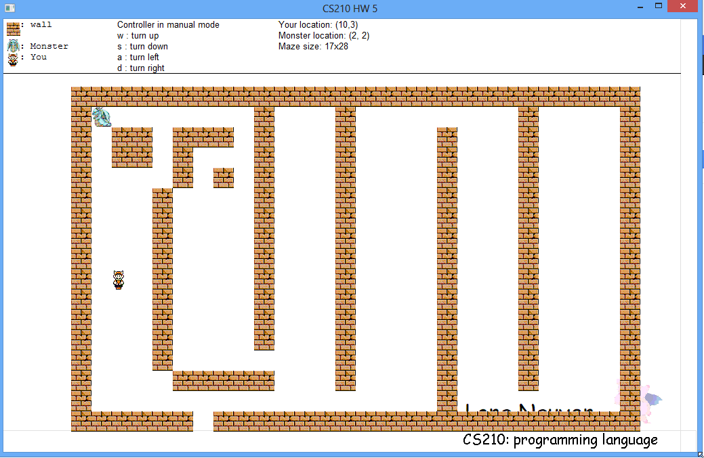

MazeGame
========

This is a simple game I created in CS210 class. I implemented this game in Unicon,
a programming language created by Dr Jeffrey (http://unicon.sourceforge.net).

You can play this game by using arrow key. Or you can let it play by itself which is 
auto mode. I implemented a backtrack algorithm to help the character escape from the
monster

Sample Output
=============

